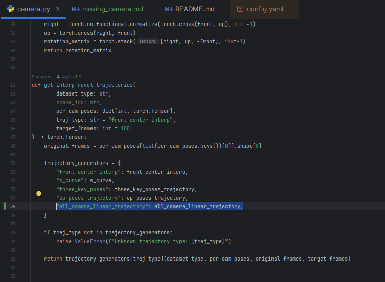
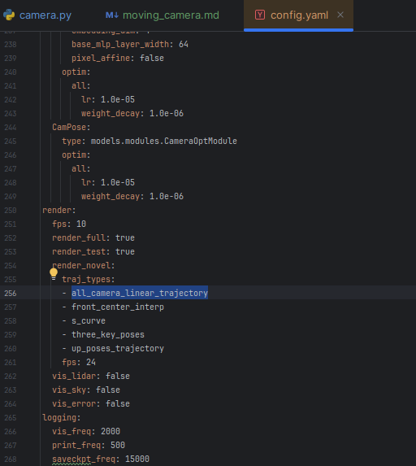

## Moving Camera

### Please refer
- function `all_camera_linear_trajectory()` in the `./utils/camera.py`

### If you implement new function, 
It should be contained, `trajectory_generators` of `get_interp_novel_trajectories()` in the `./utils/camera.py` as follows:

And, at the `config.yaml` of "trained output folder", you should add your new function at the key of `render.render_novel.traj_types`

